## 我的Github    blog:[zzのblog (iiizk.github.io)](https://iiizk.github.io/)

[TOC]

#### 俩个虚拟连接工具

https://github.com/iiizk/download/releases/download/study/MobaXterm-Chinese-Simplified.7z


https://github.com/iiizk/download/releases/download/study/SecureCRT.zip

###### 关闭防火墙

```
sudo systemctl stop firewalld.service
sudo systemctl disable firewalld.service
```

###### 改缩进

`vim /etc/vimrc`

<mark>set ts=4</mark>

###### ssh免密（每台机器都要写

root权限下
在每台机器上产生公钥
`ssh-keygen -t rsa`
一直回车确定

把公钥分发给每个机器
ssh-copy-id master
ssh-copy-id hadoop1
ssh-copy-id hadoop2

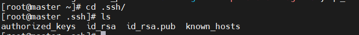

ssh master

ssh hadoop1

ssh hadoop2

###### 时间同步：

安装chrony:

`yum install chrony -y`

`vim /etc/chrony.conf`

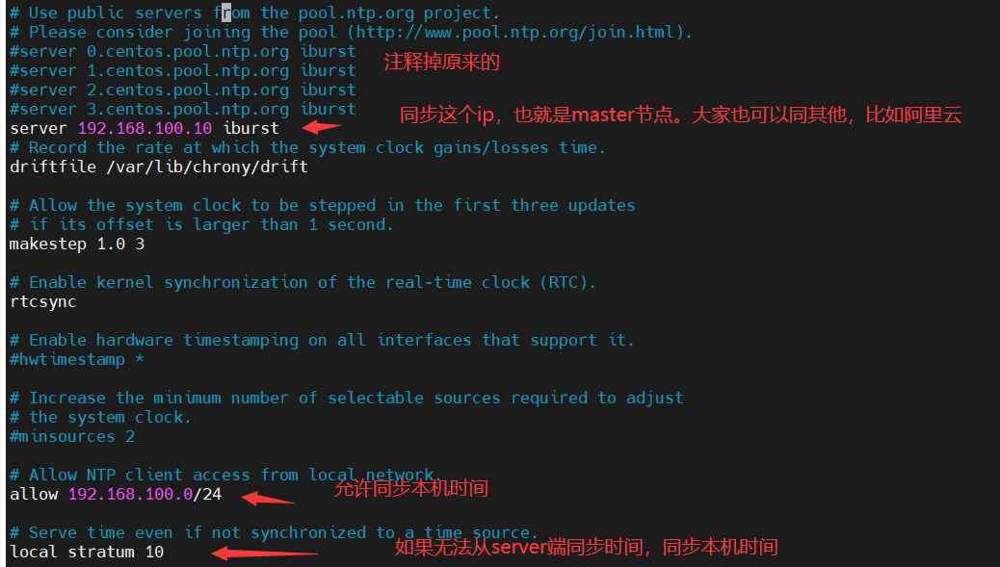

###### 设置服务的开机启动，并启动服务

```
systemctl enable chronyd 
systemctl start chronyd
chronyc sources -v
```

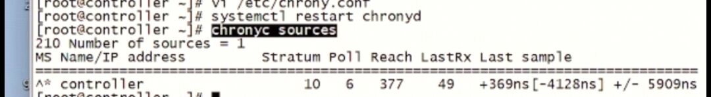

###### <mark>tzselect</mark>

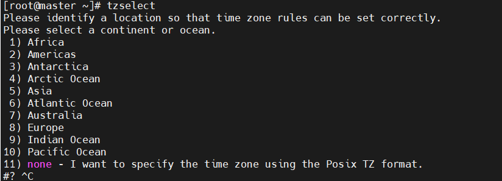

```
亚洲，中国，北京，yes
5-9-1-1
```

###### 写入环境变量 (profile中)

<mark>TZ='Asia/Shanghai'; export TZ</mark>

### 下载ntp

`yum install -y ntp`

###### 同步master时间

<mark>ntpdata master</mark>

#### NTP:

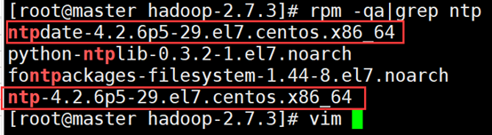

```
查看是否安装 ntp服务 ：rpm -qa|grep ntp


查看服务是否开启：systemctl status ntpd.service
如果是开启，必须关闭，然后产看三台机器上的服务是否都关闭
systemctl stop ntpd.service
systemctl disable ntpd.service 
或者
chkconfig ntpd off

chkconfig --list ntpd

修改ntp配置文件
vim /etc/ntp.conf

修改内容如下
a）修改1
（授权192.168.1.0-192.168.1.255网段上的所有机器可以从这台机器上查询和同步时间）
#restrict 192.168.1.0 mask 255.255.255.0 nomodify notrap为
restrict 192.168.1.0 mask 255.255.255.0 nomodify notrap

b）修改2
（集群在局域网中，不使用其他互联网上的时间）
server 0.centos.pool.ntp.org iburst
server 1.centos.pool.ntp.org iburst
server 2.centos.pool.ntp.org iburst
server 3.centos.pool.ntp.org iburst为
#server 0.centos.pool.ntp.org iburst
#server 1.centos.pool.ntp.org iburst
#server 2.centos.pool.ntp.org iburst
#server 3.centos.pool.ntp.org iburst
c）添加3（当该节点丢失网络连接，依然可以采用本地时间作为时间服务器为集群中的其他节点提供时间同步）
server 127.127.1.0
Fudge 127.127.1.0 stratum 10

（3）修改/etc/sysconfig/ntpd 文件
vim /etc/sysconfig/ntpd
增加内容如下（让硬件时间与系统时间一起同步）
SYNC_HWCLOCK=yes

（4）重新启动ntpd服务
systemctl start ntpd.service 
ntpd 已停
systemctl status ntpd.service
正在启动 ntpd：                                            [确定]

（5）设置ntpd服务开机启动
systemctl enable ntpd.service


其他机器配置（必须root用户）
（1）在其他机器配置10分钟与时间服务器同步一次
    定时任务命令
crontab -e
编写定时任务如下：
*/10 * * * * /usr/sbin/ntpdate master

（2）修改任意机器时间
date -s "2020-05-20 11:11:11"

（3）十分钟后查看机器是否与时间服务器同步
date
说明：测试的时候可以将10分钟调整为1分钟，节省时间。
备注：修改时间为中国时间命令：timedatectl set-timezone 'Asia/Shanghai'
```

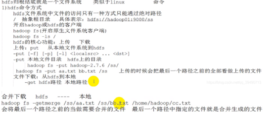

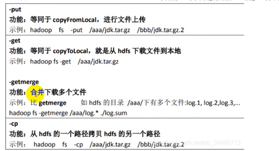

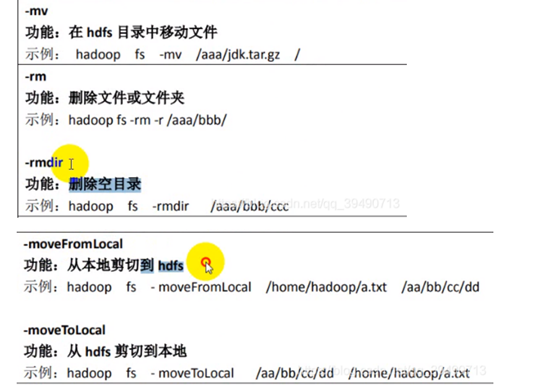

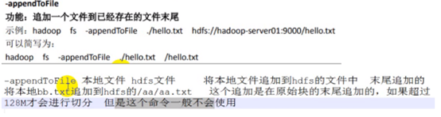

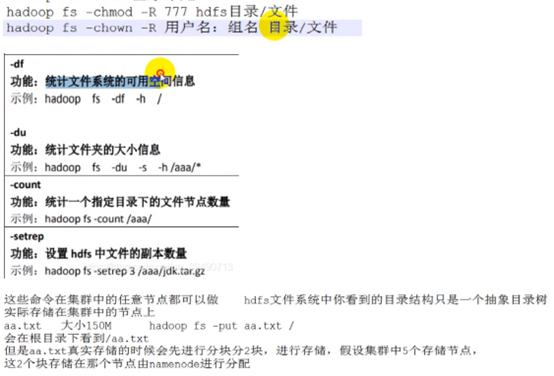

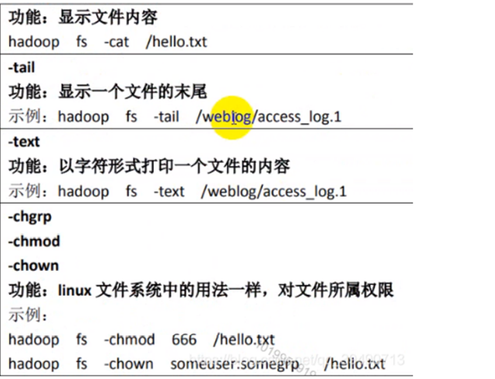

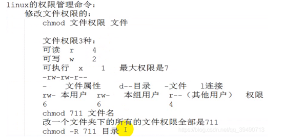

```
hadoop fs -mkdir -p /wordcount/input
hadoop fs -put /home/z/apps/hadoop-2.7.3/wcinput/jsckxxx.txt /wordcount/input
hadoop jar share/hadoop/mapreduce/hadoop-mapreduce-examples-2.7.3.jar wordcount /wordcount/input /wordcount/output
hadoop fs -get /wordcount/output/part-r-00000
```
