# Hadoop集群搭建（防火墙关，ssh免密，映射关系，时间同步）

[TOC]


###### 查看JDK相关的包

`rpm -qa | grep java`

###### 卸载

```
rpm -e --nodeps
yum remove -y
java -version 查看是否删除（返回无结果）
```

###### 安装 上传 jdk和hadoop压缩包

https://github.com/iiizk/download/releases/download/hadoop/jdk-8u221-linux-x64.tar.gz

https://github.com/iiizk/download/releases/download/hadoop/hadoop-2.7.3.tar.gz

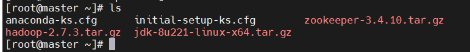

###### 解压到/usr/local/src目录下

```
tar -zxvf jdk-8u221-linux-x64.tar.gz -C /usr/local/src
tar -zxvf hadoop-2.7.3.tar.gz  -C /usr/local/src
```

###### 配置环境变量jdk 和hadoop

`vim /etc/profile`

```
#java
export JAVA_HOME=/usr/local/src/jdk1.8.0_221
export CLASSPATH=.:${JAVA_HOME}/jre/lib/rt.jar:${JAVA_HOME}/lib/dt.jar:${JAVA_HOME}/lib/tools.jar
export PATH=$PATH:${JAVA_HOME}/bin
#hadoop
export HADOOP_HOME=/usr/local/src/hadoop-2.7.3
export PATH=$PATH:${HADOOP_HOME}/bin
export PATH=$PATH:${HADOOP_HOME}/sbin/profile
```

###### 让环境生效

`source /etc/profile`

###### 查看

```
java -version
hadoop version
```

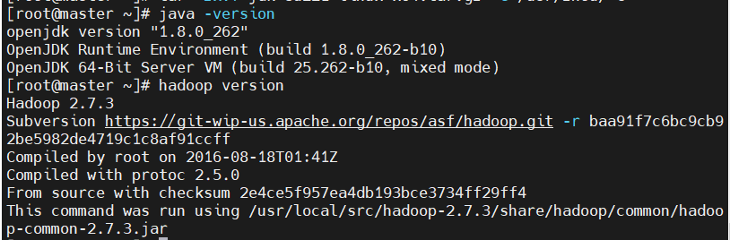

###### 本地运行：

在Hadoop目录中，配置Java环境
`etc/hadoop/hadoop-env.sh编辑这个文件`


###### 创建在hadoop-2.7.3文件下面创建一个input文件夹

`mkdir input`

###### 将Hadoop的xml配置文件复制到input

`cp etc/hadoop/*.xml input`

###### 执行share目录下的MapReduce程序

`bin/hadoop jar share/hadoop/mapreduce/hadoop-mapreduce-examples-2.7.3.jar grep input output 'dfs[a-z.]+'`

###### 查看输出结果

`cat output/*`

###### 3.1.2 官方本地WordCount案例

创建在hadoop-2.7.3文件下面创建一个wcinput文件夹
`mkdir wcinput`

在wcinput文件下创建一个wc.input文件
`cd wcinput`
`touch wc.input`

编辑wc.input文件
`vim wc.input`
在文件中输入如下内容

```
hadoop yarn
hadoop mapreduce
nihao
nihao
```

保存退出：：wq

回到Hadoop目录

执行程序

```
hadoop jar share/hadoop/mapreduce/hadoop-mapreduce-examples-2.7.3.jar wordcount wcinput wcoutput
```

查看结果
`cat wcoutput/part-r-00000`

```
nihao 2
hadoop 2
mapreduce 1
yarn 1
```

```
（a）在HDFS文件系统上创建一个input文件夹
[master@master hadoop-2.7.3]$ bin/hdfs dfs -mkdir -p /user/master/input
        （b）将测试文件内容上传到文件系统上
[master@master hadoop-2.7.3]$bin/hdfs dfs -put wcinput/wc.input
  /user/master/input/
        （c）查看上传的文件是否正确
[master@master hadoop-2.7.3]$ bin/hdfs dfs -ls  /user/master/input/
[master@master hadoop-2.7.3]$ bin/hdfs dfs -cat  /user/master/input/wc.input
        （d）运行MapReduce程序
bin/hadoop jar  share/hadoop/mapreduce/hadoop-mapreduce-examples-2.7.3.jar wordcount /user/master/input/ /user/master/output        （e）查看输出结果
命令行查看：
bin/hdfs dfs -cat /user/master/output/*
```

###### 如图所示


```
（f）将测试文件内容下载到本地
[master@master hadoop-2.7.3]$ hdfs dfs -get /user/master/output/part-r-00000 ./wcoutput/
（g）删除输出结果
[master@master hadoop-2.7.3]$ hdfs dfs -rm -r /user/master/output
```

## 伪分布式：HDFS

`vim hadoop-env.sh`


`vim core-site.xml`

```
<!-- 指定HDFS中NameNode的地址 -->
<property>        
    <name>fs.defaultFS</name>
    <value>hdfs://master:9000</value>
</property>

<!-- 指定Hadoop运行时产生文件的存储目录 -->
<property>
    <name>Hadoop.tmp.dir</name>
    <value>/usr/local/src/hadoop-2.7.3/data/tmp</value>
</property>
```

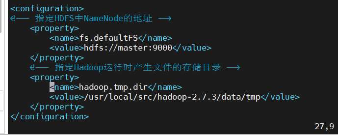

`vim hdfs-site.xml`

```
<property>
    <name>dfs.replication</name>
    <value>1</value>
</property>
```

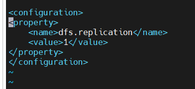

`vim slaves`（这里我吧三台主机都写进去了）

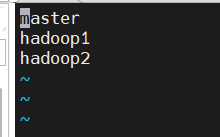

`vim /etc/hosts`(这里我吧三台映射都写进去了)

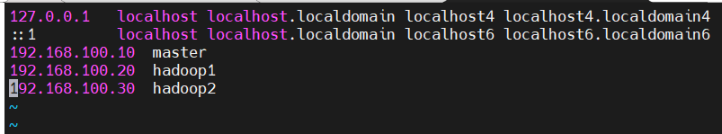

#### 格式化NameNode (在hadoop主目录下)

```
bin/hdfs namenode -format
```

#### 启动HDFS（要关防火墙）

`sbin/start-dfs.sh`


[http://192.168.100.10:50070/](http://192.168.100.10:50070/)

http://master:50070/（这个也可以不过要和pc机做映射）


在**C:\Windows\System32\drivers\etc**目录下(这里三台机子我都做了映射)

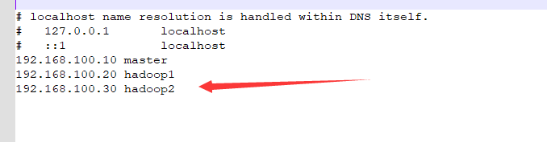

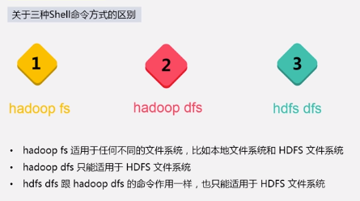

#### YARN:

`vim  yarn-env.sh`


`vim yarn-site.xml`

```
<!-- Reducer获取数据的方式 -->
    <property>
        <name>yarn.nodemanager.aux-services</name>
        <value>mapreduce_shuffle</value>
    </property>

<!-- 指定YARN的ResourceManager的地址 -->
    <property>
        <name>yarn.resourcemanager.hostname</name>
        <value>master</value>
</property>
```

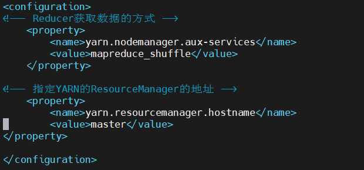

`vim mapred-env.sh`

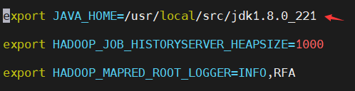

重命名

`mv mapred-site.xml.template mapred-site.xml`

也可以复制并改名

`cp mapred-site.xml.template mapred-site.xml`

`vim mapred-site.xml`

```
<!-- 指定MR运行在YARN上 -->
<property>
        <name>mapreduce.framework.name</name>
        <value>yarn</value>
</property>
```

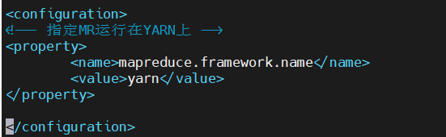

#### 启动集群 (启动前必须保证NameNode和DataNode已经启动)（要关防火墙）

`sbin/start-yarn.sh`

[http://192.168.100.20:8088/](http://192.168.100.20:8088/)

#### <mark>完全分布式（重点）</mark>

`cd /usr/local/src/hadoop-2.7.3/etc/hadoop/`

###### （1）核心配置文件

###### 配置core-site.xml

`vim core-site.xml`

```
<!-- 指定HDFS中NameNode的地址 -->
    <property>
        <name>fs.defaultFS</name>
        <value>hdfs://master:9000</value>
    </property>
    <!-- 指定Hadoop运行时产生文件的存储目录 -->
    <property>
        <name>hadoop.tmp.dir</name>
        <value>/usr/local/src/hadoop-2.7.3/data/tmp</value>
    </property>
```


#### （2）HDFS配置文件

#### 配置hadoop-env.sh

`vim  hadoop-env.sh`


#### （3） hdfs-site.xml

`vim hdfs-site.xml`

```
<!-- 指定副本的数量-->
    <property>
        <name>dfs.replication</name>
        <value>3</value>
    </property>
<!-- 指定Hadoop辅助名称节点主机配置 -->
    <property>
        <name>dfs.namenode.secondary.http-address</name>
        <value>hadoop2:50090</value>
    </property>
<!--?存储fsimage文件的地方-->
    <property>
        <name>dfs.namenode.name.dir</name>
        <value>/usr/local/src/hadoop-2.7.3/data/tmp/dfs/name</value>
    </property>
<!--?HDFS数据存放block的地方-->
    <property>
        <name>dfs.datanode.data.dir</name>
        <value>/usr/local/src/hadoop-2.7.3/data/tmp/dfs/data</value>
    </property>
```

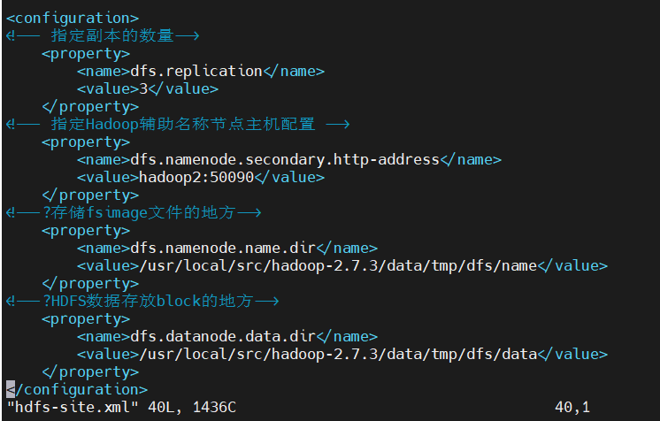

#### （4）配置yarn-env.sh

`vim yarn-env.sh`


#### （5） <mark>yarn-site.xml</mark>

`vim yarn-site.xml`

```
<!-- Reducer获取数据的方式 -->
    <property>
        <name>yarn.nodemanager.aux-services</name>
        <value>mapreduce_shuffle</value>
    </property>
<!-- 指定YARN的ResourceManager的地址 -->
    <property>
        <name>yarn.resourcemanager.hostname</name>
        <value>hadoop1</value>
    </property>
```

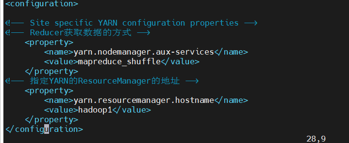

#### （6）MapReduce配置文件

`vim mapred-env.sh`


### （7）mapred-site.xml(先重命名)

`mv mapred-site.xml.template mapred-site.xml`

`vim mapred-site.xml`

```
<!-- 指定MR运行在YARN上 -->
    <property>
        <name>mapreduce.framework.name</name>
        <value>yarn</value>
    </property>
<!-- 历史服务器端地址 -->
    <property>
        <name>mapreduce.jobhistory.address</name>
        <value>master:10020</value>
    </property>
<!-- 历史服务器web端地址 -->
    <property>
        <name>mapreduce.jobhistory.webapp.address</name>
        <value>master:19888</value>
    </property>
    <property>
        <name>yarn.application.classpath</name>
        <value>%HADOOP_HOME%/share/hadoop/mapreduce/*,%HADOOP_HOME%/share/hadoop/mapreduce/lib/*,%HADOOP_HOME%/share/hadoop/common/*,%HADOOP_HOME%/share/hadoop/common/lib/*,%HADOOP_HOME%/share/hadoop/yarn/*,%HADOOP_HOME%/share/hadoop/yarn/lib/*,%HADOOP_HOME%/share/hadoop/hdfs/*,%HADOOP_HOME%/share/hadoop/hdfs/lib/* </value>
    </property>
    <property>
        <name>yarn.nodemanager.resource.memory-mb</name>
        <value>2048</value>
    </property>
    <property>
        <name>yarn.scheduler.minimum-allocation-mb</name>
        <value>2048</value>
    </property>
    <property>
        <name>yarn.nodemanager.resource.cpu-vcores</name>
        <value>1</value>
    </property>
```

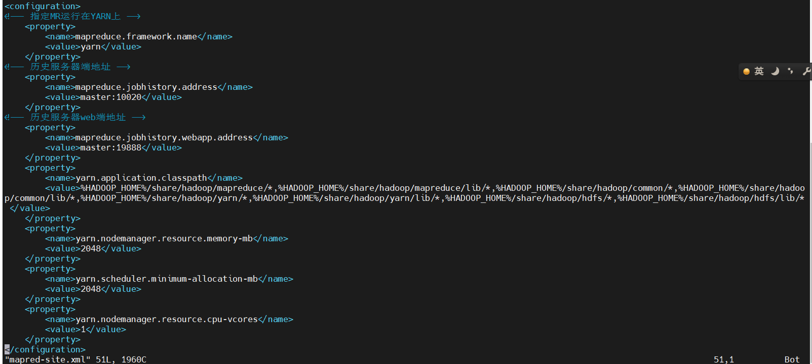

#### （8）配置slaves文件（几台都要配）

`vim slaves`


#### (9) 配置映射（几台都要配）

`vim /etc/hosts`


#### （10）复制给另外俩台机子

```
进入hadoop所在目录
cd /usr/local/src/
复制给另外俩台机子
scp -r hadoop-2.7.3 root@hadoop1:/usr/local/src/
scp -r hadoop-2.7.3 root@hadoop2:/usr/local/src/
```

#### （11）（hadoop目录下）

```
删除三台机器的data和logs(hadoop目录)
rm -rf logs/
rm -rf data/
```

###### 在master主节点执行

进去hadoop
`cd /usr/local/src/hadoop-2.7.3`

格式化namenode
`bin/hdfs namenode -format`

启动hdfs
`sbin/start-dfs.sh`

###### 查看（要关防火墙）

http://192.168.100.10:50070/

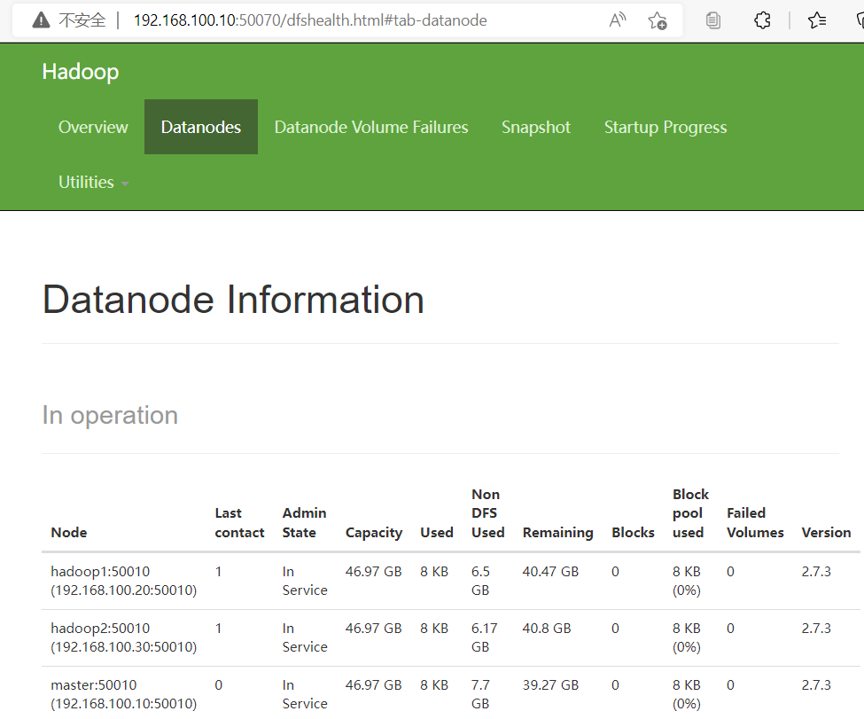

###### jps

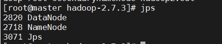


###### hadoop1节点执行 （执行yarn,yarn配置指定在hadoop1上执行了）

###### 注意：NameNode和ResourceManger如果不是同一台机器，不能在NameNode上启动 YARN，应该在ResouceManager所在的机器上启动YARN。根据我们的配置，在hadoop1上了，所以要在hadoop1上启动

启动yarn

`sbin/start-dfs.sh`

###### 查看（要关防火墙）

http://192.168.100.20:8088/

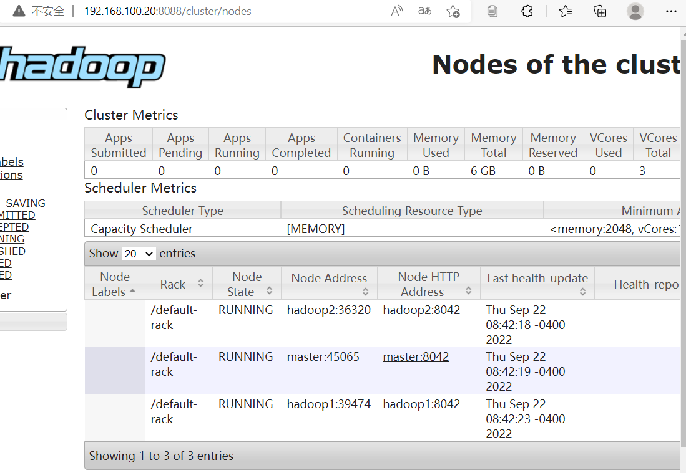

###### jps

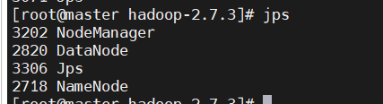

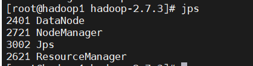

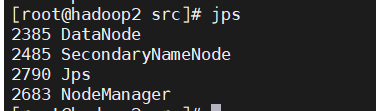

```
（1）在集群上创建一个文件：
hdfs dfs -mkdir –p ceshi / 或者 hadoop fs
（2）上传文件到集群：
hdfs dfs –put wcinput /
（3）测试运行单词统计程序：
hadoop jar share/hadoop/mapreduce/hadoop-mapreduce-examples-2.7.3.jar wordcount /wcinput /wcoutput
```

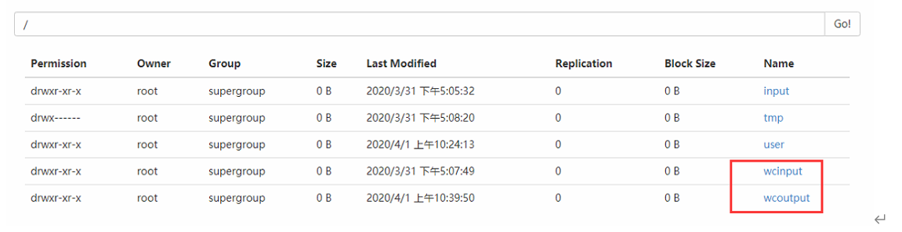

```
关闭YARN和Hadoop和历史服务器：
（1）在master主机上执行：
sbin/stop-dfs.sh
（2）在hadoop1上：
[root@hadoop1 hadoop-2.7.3]$sbin/stop-yarn.sh
[root@hadoop1 hadoop-2.7.3]$sbin/mr-jobhistory-daemon.sh stop historyserver
```
