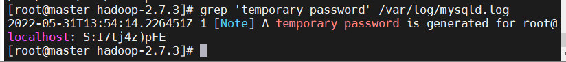
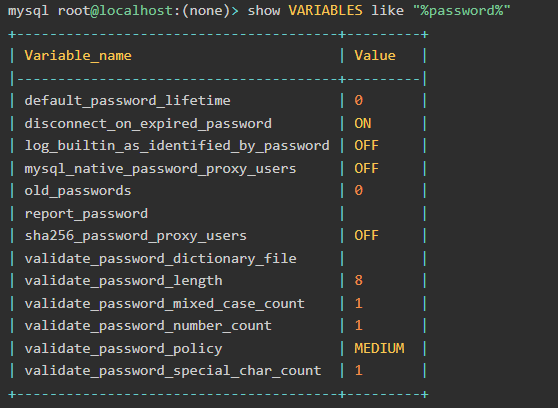

# LinuxCentOS7安装MySQL5.7版本

[CentOS7.4用yum安装并配置MySQL5.7 - OpsDrip - 博客园 (cnblogs.com)](https://www.cnblogs.com/opsprobe/p/10681063.html)

[TOC]


###### 1.  查询原有的版本，CentOS7会自带一个版本

`rpm -qa | grep mariadb`

###### 2.  查询是否有MySQL

`rpm -qa | grep mysql `
*如果有，删除：yum -y remove 查询出来的版本
删除原来安装过的mysql残留的数据（这一步非常重要，问题就出在这）*
**rm -rf /var/lib/mysql**

###### 3.  卸载原有的

```
rpm -e nodeps mariadb-libs 或者
yum -y remove mariadb-libs
```

###### 4.  配置YUM源，在MySQL官网中下载YUM源rpm安装包

`wget
http://dev.mysql.com/get/mysql57-community-release-el7-11.noarch.rpm`

###### 5.  安装MySQL源

```
yum localinstall mysql57-community-release-el7-11.noarch.rpm -y
```

###### 6.  检查MySQL源是否安装成功

`yum repolist enabled | grep "mysql.*-community.*"`

###### 7.  安装MySQL

`yum install mysql-community-server -y`

###### 8.  失败了请尝试(https://repo.mysql.com/mysql57-community-release-el7-11.noarch.rpm)

```
1.清理软件源
yum clean all
2.建立源数据缓存
yum makecache

MySQL GPG 密钥已过期导致的 问题解决出处 
https://bugs.mysql.com/bug.php?id=106188

```

rpm --import https://repo.mysql.com/RPM-GPG-KEY-mysql-2022

###### 9.   启动MySQL ：

`systemctl start mysqld`

设置开机自启 ：

```
systemctl enable mysqld
systemctl daemon-reload
```

查询MySQL启动状态
`systemctl status mysqld`

mysql安装完成之后，在/var/log/mysqld.log文件中给root生成了一个默认密码。我们需要修改为自己可以记得住简单的密码，供学习使用
查询数据库初始密码：
`grep 'temporary password' /var/log/mysqld.log`



###### 10.  登陆MySQL

`mysql -u root -p`
然后输入（复制）密码
修改密码：
`set password = password('123456');`
这里需要设置为大写字母，小写字母数字组合密码，比如：Bob1989$
可以查看一下密码策略
`show VARIABLES like "%password%";`



输入：exit 退出
`exit;`

在/etc/my.cnf文件添加配置，指定密码策略.
`vim /etc/my.cnf`

```
# 如果不需要密码策略，禁用密码策略
validate_password = off
# 字符编码设置为utf8
character_set_server = utf8
init_connect = 'SET NAMES utf8'
# 设置一下过期时间，以防止密码失效
default_password_lifetime=0
# 设置数据库表名不区分大小（0：区分大小写，1：不区分大小写），Linux下默认对MySQL数据库表名区分大小写，Windows下不区分
lower_case_table_names=1

```

###### 11.  重启mysqld服务：

`systemctl restart mysqld.service`

```
grep 'temporary password' /var/log/mysqld.log
mysql -u root -p
然后输入（复制）密码 修改密码：
set password = password('123456');
```

###### 12.  可以用命令让密码不会失效（不用执行）

```
ALTER USER 'root'@'123456' PASSWORD EXPIRE NEVER;
FLUSH PRIVILEGES;
```

###### 13.  查看数据库

```
show databases;
创建一个测试数据库进行测试
create database mydb1;
查看是否存在：
show databases;
进入数据库：
use mydb1
创一个表格：
create table user(id int,username varchar(100));
插入一条数据：
insert into user values(1, '纪');
insert into user values(1, 'ji');
select * from user;
查看现有的字符集
show variables like 'char%';
```

###### 14.  数据库远程访问授权：

```
grant all on *.* to root@'%' identified by '123456' with grant option; 
flush privileges;


grant all privileges on *.* to root@"%" identified by "123456";
flush privileges;
```


###### 其他常见错误：

###### 密码忘记
```
systemctl stop mysqld
vi /etc/my.cnf
在文件的[mysqld]标签下添加一句：skip-grant-tables
systemctl start mysqld
进入mysql
mysql -u root
修改密码
use mysql;
update mysql.user set authentication_string=password('123456') where user='root';
flush privileges;
```
```
默认配置文件路径：
配置文件：/etc/my.cnf
日志文件：/var/log//var/log/mysqld.log
服务启动脚本：/usr/lib/systemd/system/mysqld.service
socket文件：/var/run/mysqld/mysqld.pid

```


###### 数据字符错误插入

```
查看现有的字符集
show variables like 'char%';
退出：
exit
进入配置文件： vim /etc/my.cnf
添加以下字段：
character-set-server=utf8
[client]
default-character-set=utf8
[mysql]
no-auto-rehash
default-character-set=utf8
保存并退出
exit
重启mysqld服务：
systemctl restart mysqld.service
输入:
mysql -u root-proot
进入mysql，查询数据
查看现有的字符集
show variables like 'char%';
查看刚才创建表格的字符集：
show create database mydb1;
进入刚才创建的数据库：
use mydb1
修改现有的数据库字符集：
alter database mydb1 character set 'utf8';
修改数据表的字符集：
alter table user convert to character查询数据，插入一条带汉字的数据，并查询。
insert into user values(1, '纪');
select * from user; set 'utf8'; 

```
