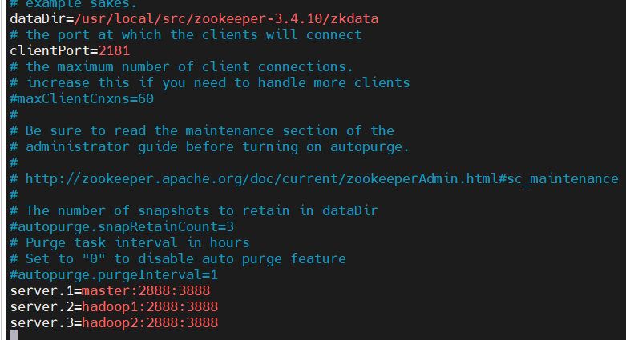
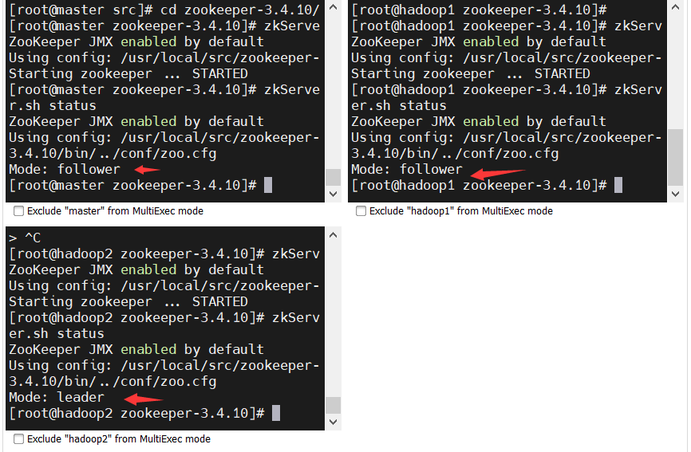
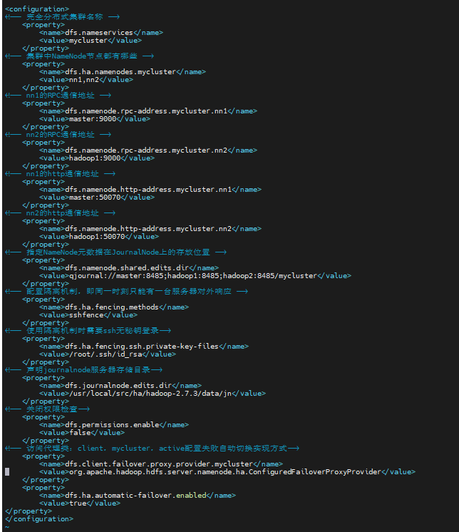
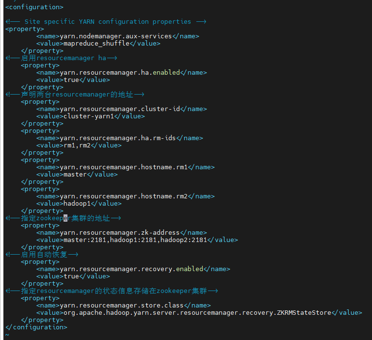
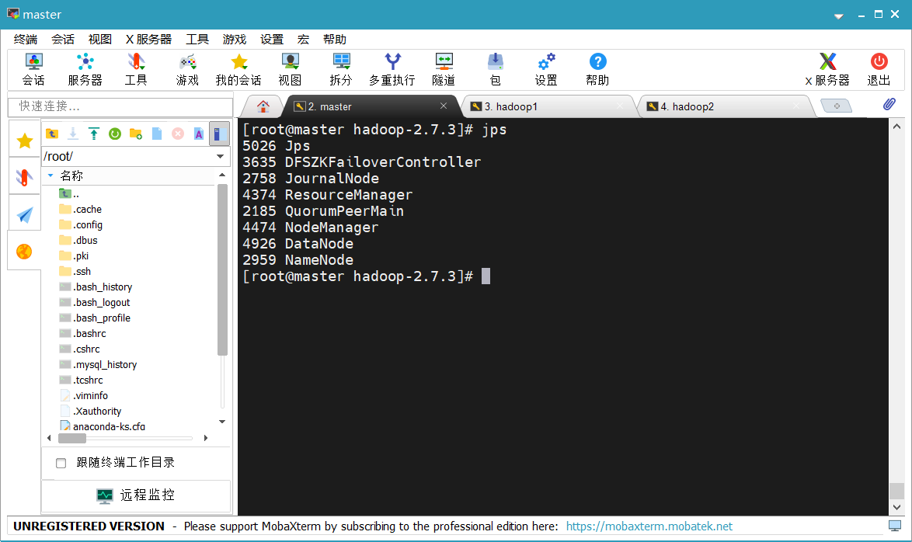

## zookeeper安装

https://github.com/iiizk/download/releases/download/hadoop/zookeeper-3.4.10.tar.gz

[TOC]


###### 解压

`cd zookeeper-3.4.10`

###### 创建一个文件夹

`mkdir zkdata`

###### 并复制路径

`cd zkdata`

`pwd`

###### 进入conf目录

`cd conf`

###### 复制文件，并重命名

`cp zoo_sample.cfg zoo.cfg`

编辑文件 vim zoo.cfg
（1）在dataDir中修改路径                

```
server.1=master:2888:3888
server.2=hadoop1:2888:3888
server.3=hadoop2:2888:3888
```



###### quorumListenOnAllIPs ：该参数设置为true，配置为true可以避免入坑（尤其是多网卡主机），Zookeeper服务器将监听所有可用IP地址的连接。

`quorumListenOnAllIPs=true`

```
配置参数解读
Server.A=B:C:D
A是一个数字，表示这个是第几号服务器；
B是这个服务器的IP地址；
C是这个服务器与集群中的Leader服务器交换信息的端口；
D是万一集群中的Leader服务器挂了，需要一个端口来重新进行选举，选出一个新的Leader，而这个端口就是用来执行选举时服务器相互通信的端口。
集群模式下配置一个文件myid，这个文件在dataDir目录下，这个文件里面有一个数据就是A的值，Zookeeper启动时读取此文件，拿到里面的数据与zoo.cfg里面的配置信息比较从而判断到底是哪个server。
```

###### 进入zkdata目录

`cd  /usr/local/src/zookeeper-3.4.10/zkdata 目录`
（1）创建 一个 myid的文件

（2）编辑myid文件
`vim myid`

**在文件中添加与server对应的编号：如1
拷贝配置好的zookeeper到其他机器上**

```
scp -r zookeeper-3.4.10 root@hadoop1:/usr/local/src/
```

```
scp -r zookeeper-3.4.10 root@hadoop2:/usr/local/src/
```

###### 并分别在三台节点上，配置zookeeper的环境变量：

```
#zookeeper
export ZK_HOME=/usr/local/src/zookeeper-3.4.10
export PATH=$PATH:${JAVA_HOME}/bin:${HADOOP_HOME}/bin:${HADOOP_HOME}/sbin:${ZK_HOME}/bin
```

<mark>source /etc/profile</mark>

#### 启动

###### 分别在3台节点上执行

Zookeeper在大多数节点存活下， 才会有效。所以启动第一台的时候，会报错，等三台节点都启动完毕之后，就会正常了

#启动ZK服务

```
bin/zkServer.sh start
```

#停止ZK服务

```
bin/zkServer.sh stop
```

#重启ZK服务

```
bin/zkServer.sh restart
```

#查看ZK服务状态

```
bin/zkServer.sh status
```



## ha高可用

进入 cd /usr/local/src目录
创建一个新的目录
mkdir ha
复制一个hadoop2.7.3文件。
cp -rvf hadoop-2.7.3 ha/
进入ha下面的hadoop目录
把目录多余的文件进行删除，使用命令
rm –rf data
rm –rf logs
配置文件

#### 进入etc/hadoop中配置

#### <mark>core-site.xml</mark>

```
<!-- 把两个NameNode）的地址组装成一个集群mycluster -->
    <property>
        <name>fs.defaultFS</name>
        <value>hdfs://mycluster</value>
    </property>
<!-- 指定hadoop运行时产生文件的存储目录 -->
    <property>
        <name>hadoop.tmp.dir</name>
        <value>/usr/local/src/ha/hadoop-2.7.3/data/tmp</value>
    </property>
    <property>
        <name>ha.zookeeper.quorum</name>
        <value>master:2181,hadoop1:2181,hadoop2:2181</value>
    </property>
```


#### <mark>hdfs-site.xml</mark>

```
<!-- 完全分布式集群名称 -->
    <property>
        <name>dfs.nameservices</name>
        <value>mycluster</value>
    </property>
<!-- 集群中NameNode节点都有哪些 -->
    <property>
        <name>dfs.ha.namenodes.mycluster</name>
        <value>nn1,nn2</value>
    </property>
<!-- nn1的RPC通信地址 -->
    <property>
        <name>dfs.namenode.rpc-address.mycluster.nn1</name>
        <value>master:9000</value>
    </property>
<!-- nn2的RPC通信地址 -->
    <property>
        <name>dfs.namenode.rpc-address.mycluster.nn2</name>
        <value>hadoop1:9000</value>
    </property>
<!-- nn1的http通信地址 -->
    <property>
        <name>dfs.namenode.http-address.mycluster.nn1</name>
        <value>master:50070</value>
    </property>
<!-- nn2的http通信地址 -->
    <property>
        <name>dfs.namenode.http-address.mycluster.nn2</name>
        <value>hadoop1:50070</value>
    </property>
<!-- 指定NameNode元数据在JournalNode上的存放位置 -->
    <property>
        <name>dfs.namenode.shared.edits.dir</name>
        <value>qjournal://master:8485;hadoop1:8485;hadoop2:8485/mycluster</value>
    </property>
<!-- 配置隔离机制，即同一时刻只能有一台服务器对外响应 -->
    <property>
        <name>dfs.ha.fencing.methods</name>
        <value>sshfence</value>
    </property>
<!-- 使用隔离机制时需要ssh无秘钥登录-->
    <property>
        <name>dfs.ha.fencing.ssh.private-key-files</name>
        <value>/root/.ssh/id_rsa</value>
    </property>
<!-- 声明journalnode服务器存储目录-->
    <property>
        <name>dfs.journalnode.edits.dir</name>
        <value>/usr/local/src/ha/hadoop-2.7.3/data/jn</value>
    </property>
<!-- 关闭权限检查-->
    <property>
        <name>dfs.permissions.enable</name>
        <value>false</value>
    </property>
<!-- 访问代理类：client，mycluster，active配置失败自动切换实现方式-->
    <property>
        <name>dfs.client.failover.proxy.provider.mycluster</name>
        <value>org.apache.hadoop.hdfs.server.namenode.ha.ConfiguredFailoverProxyProvider</value>
    </property>
    <property>
        <name>dfs.ha.automatic-failover.enabled</name>
        <value>true</value>
</property>
```



##### <mark>yarn-site.xml</mark>


```
<!-- Site specific YARN configuration properties -->
<property>
        <name>yarn.nodemanager.aux-services</name>
        <value>mapreduce_shuffle</value>
    </property>
<!--启用resourcemanager ha-->
    <property>
        <name>yarn.resourcemanager.ha.enabled</name>
        <value>true</value>
    </property>
<!--声明两台resourcemanager的地址-->
    <property>
        <name>yarn.resourcemanager.cluster-id</name>
        <value>cluster-yarn1</value>
    </property>
    <property>
        <name>yarn.resourcemanager.ha.rm-ids</name>
        <value>rm1,rm2</value>
    </property>
    <property>
        <name>yarn.resourcemanager.hostname.rm1</name>
        <value>master</value>
    </property>
    <property>
        <name>yarn.resourcemanager.hostname.rm2</name>
        <value>hadoop1</value>
    </property>
<!--指定zookeeper集群的地址-->
    <property>
        <name>yarn.resourcemanager.zk-address</name>
        <value>master:2181,hadoop1:2181,hadoop2:2181</value>
    </property>
<!--启用自动恢复-->
    <property>
        <name>yarn.resourcemanager.recovery.enabled</name>
        <value>true</value>
    </property>
<!--指定resourcemanager的状态信息存储在zookeeper集群-->
    <property>
        <name>yarn.resourcemanager.store.class</name>     
        <value>org.apache.hadoop.yarn.server.resourcemanager.recovery.ZKRMStateStore</value>
    </property>
```

 

##### <mark>拷贝配置好的hadoop环境到其他节点</mark>

cd /usr/local/src

```
scp -r ha root@hadoop1:/usr/local/src/
```

```
scp -r ha root@hadoop2:/usr/local/src/
```

###### 在所有节点上，输入以下命令启动journalnode服务

###### （1）在（<mark>master</mark>）上，输入以下命令启动每个节点的journalnode服务：

```
sbin/hadoop-daemons.sh start journalnode
```

<mark>（这里的sbin不能少，确保启动的是ha里面的hadoop，而不是之前的hadoop）</mark>

（2）在[nn1]<mark>master</mark>上，对其进行格式化：

```
bin/hdfs namenode -format
```

（3）在[nn1]<mark>master</mark>上，初始化HA在Zookeeper中状态：（Zookeeper要启动）

```
bin/hdfs zkfc -formatZK
```

（4）在[nn1]<mark>maste</mark>r上启动

```
sbin/hadoop-daemon.sh start namenode
```

（5）在<mark>hadoop1[</mark>nn2]上，同步nn1的元数据信息：

```
bin/hdfs namenode -bootstrapStandby
```

（6）启动<mark>hadoop1 </mark>[nn2]上：

```
sbin/hadoop-daemon.sh start namenode
```

（7）启动所有DataNode在<mark>master</mark>上

```
sbin/hadoop-daemons.sh start datanode
```

（8）在各个NameNode节点上启动DFSZK
Failover Controller，先在哪台机器启动，哪个机器的NameNode就是Active NameNode，启动一个就行

（**sbin/hadoop-daemons.sh start zkfc）是执行全部，可以自己执行一个即可**

###### 在master上执行即可

```
sbin/hadoop-daemon.sh start zkfc
```

（9）查看[nn1]是否为Active

```
bin/hdfs haadmin -getServiceState nn1
```

###### 2.    启动YARN

（1）在master中执行：

```
sbin/start-yarn.sh
```

（2）在hadoop1中执行：

```
sbin/yarn-daemon.sh start resourcemanager
```

（3）查看服务状态

```
bin/yarn rmadmin -getServiceState rm1
```

###### 

###### 将Active NameNode进程kill

<mark>kill -9 namenode的进程id</mark>

###### 全部强制关掉
kill -9 -1

#### 第二次及以后启动HA高可用节点和zookeeper

1、分别在3台节点的zookeeper-3.4.10上执行：

```
bin/zkServer.sh start
```

```
bin/zkServer.sh status
```

2、在主节点的ha目录下输入以下命令，启动HDFS服务

```
sbin/start-dfs.sh
```

3、在master中执行：

```
sbin/start-yarn.sh
```

4、在hadoop1中执行：

```
sbin/yarn-daemon.sh start resourcemanager
```
