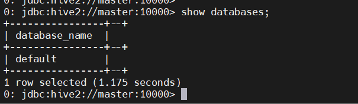
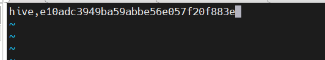
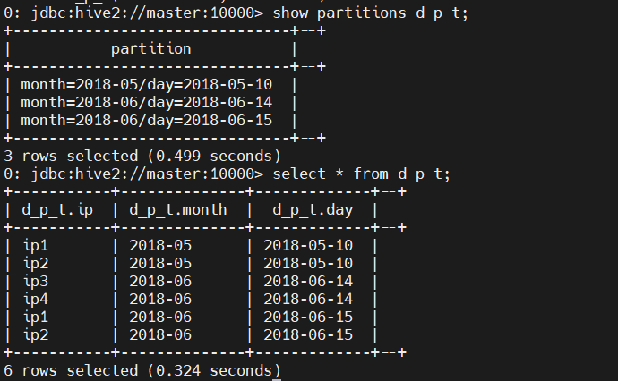

# hive安装


[TOC]


### 嵌入模式

###### 解压

https://github.com/iiizk/download/releases/download/hadoop/apache-hive-1.2.1-bin.tar.gz

`tar -zxvf apache-hive-1.2.1-bin.tar.gz -C /usr/local/src`
###### 进入hive
```
cd /usr/local/src/apache-hive-1.2.1-bin/bin
```
###### 备份一个然后编辑
`cp hive hive.bak`
`vim hive`


###### 改成


```
${SPARK_HOME}/jars/*.jar
```
###### 把jar包拷贝到hadoop路径
```
cp /usr/local/src/apache-hive-1.2.1-bin/lib/jline-2.12.jar /usr/local/src/hadoop-2.7.3/share/hadoop/yarn/lib/
```
###### 先启动hadoop完全分布式(cd /usr/local/src/hadoop-2.7.3)
master:
`sbin/start-dfs.sh`
hadoop1:
`sbin/start-yarn.sh`
###### 启动hive(cd /usr/local/src/apache-hive-1.2.1-bin/)
master:
`bin/hive`


### 本地和远程模式安装(mysql要装好)

```
cd /usr/local/src/apache-hive-1.2.1-bin/conf
cp hive-env.sh.template hive-env.sh
```

```
vim hive-env.sh
export HADOOP_HOME=/usr/local/src/hadoop-2.7.3
export HIVE_CONF_DIR=/usr/local/src/apache-hive-1.2.1-bin/conf
或者
echo 'export HADOOP_HOME=/usr/local/src/hadoop-2.7.3'>> hive-env.sh

echo 'export HIVE_CONF_DIR=/usr/local/src/apache-hive-1.2.1-bin/conf'>> hive-env.sh
```


###### 修改日志

```
mv hive-log4j.properties.template hive-log4j.properties
vim hive-log4j.properties

日志放在目录下
/usr/local/src/apache-hive-1.2.1-bin/logs
```


###### 添加hive-site.xml配置文件(密码改成mysql密码)

vim hive-site.xml
```
<?xml version="1.0" encoding="UTF-8" standalone="no"?>
<?xml-stylesheet type="text/xsl" href="configuration.xsl"?>
<configuration>
  <property>
    <name>javax.jdo.option.ConnectionURL</name>
    <value>jdbc:mysql://localhost:3306/hive?createDatabaseIfNotExist=true</value>
    <description>Mysql连接协议JDBC connect string for a JDBC metastore</description>
  </property>
  <property>
    <name>javax.jdo.option.ConnectionDriverName</name>
    <value>com.mysql.jdbc.Driver</value>
    <description>JDBC连接驱动Driver class name for a JDBC metastore</description>
  </property>
  <property>
    <name>javax.jdo.option.ConnectionUserName</name>
    <value>root</value>
    <description>用户名username to use against metastore database</description>
  </property>
  <property>
    <name>javax.jdo.option.ConnectionPassword</name>
<value>123456</value>
    <description>密码password to use against metastore database</description>
  </property>
</configuration>
```


###### 安装MySQL连接的jar包(mysql-connector-java-5.1.27-bin.jar)

https://github.com/iiizk/download/releases/download/jar/mysql-connector-java-5.1.27-bin.jar

下载mysql-connector-java-5.1.27-bin.jar包
上传到/usr/local/src/apache-hive-1.2.1-bin/lib


###### 进入MySQL 
` mysql -uroot -p`

###### 在MySQL中为hive新建数据库，用来保存hive的元数据
```
create database hive;
exit
```

###### 配置环境变量
vim /etc/profile
```
#hive
export HIVE_HOME=/usr/local/src/apache-hive-1.2.1-bin
export PATH=$PATH:${HIVE_HOME}/bin
```
source /etc/profile


###### 启动hive
hive是基于Hadoop的数据仓库，会把用户输入的查询语句自动转换成为MapReduce任务来执行，并把结果返回给用户。因此，启动hive之前，需要先启动Hadoop集群

###### 在hive的根目录输入
```
bin/hive
```

### 配置metastore  （这里我没有配置）
```
<!-- 如果使用了下面这个配置得先启动metastore，否则hiveserver2会报错跑不起来 -->
	<property>
		<name>hive.metastore.uris</name>
		<value>thrift://192.168.100.10:9083</value>
		<description>指向的是运行metastore服务的主机</description>
	</property>
	<property>
		<name>hive.metastore.warehouse.dir</name>
		<value>/user/hive/warehouse2</value>
	</property>
	<property>
		<name>hive.cli.print.current.db</name>
		<value>true</value>
		<description>
			Whether to include the	current	database in	the	Hive prompt.
		</description>
	</property>
	<property>
		<name>hive.cli.print.header</name>
		<value>true</value>
		<description>
			Whether to print the names of the columns in query output.
		</description>
	</property>
```

### 先启动
`./bin/hive --service metastore`
### 再启动
`bin/hive`


###### 编辑文件

vim hive-site.xml(本地链接改成master)这边我只在master上装了mysql，所以测试master
```
<?xml version="1.0" encoding="UTF-8" standalone="no"?>
<?xml-stylesheet type="text/xsl" href="configuration.xsl"?>
<configuration>
  <property>
    <name>javax.jdo.option.ConnectionURL</name>
    <value>jdbc:mysql://master:3306/hive?createDatabaseIfNotExist=true</value>
    <description>Mysql连接协议JDBC connect string for a JDBC metastore</description>
  </property>
  <property>
    <name>javax.jdo.option.ConnectionDriverName</name>
    <value>com.mysql.jdbc.Driver</value>
    <description>JDBC连接驱动Driver class name for a JDBC metastore</description>
  </property>
  <property>
    <name>javax.jdo.option.ConnectionUserName</name>
    <value>root</value>
    <description>用户名username to use against metastore database</description>
  </property>
  <property>
    <name>javax.jdo.option.ConnectionPassword</name>
<value>123456</value>
    <description>密码password to use against metastore database</description>
  </property>
</configuration>
```


###### 吧hive传给另外俩台(在/usr/local/src目录下)

```
scp -r apache-hive-1.2.1-bin root@hadoop1:$PWD
scp -r apache-hive-1.2.1-bin root@hadoop2:$PWD
```

###### 启动
```
cd /usr/local/src/apache-hive-1.2.1-bin
bin/hiveserver2
```


###### 解决将hive-site.xml中的localhost替换成master无法访问：

设置为远程登录：GRANT ALL ON 表示所有权限，% 表示通配所有 host，可以访问远程。

GRANT ALL PRIVILEGES ON *.* TO 'root'@'%' IDENTIFIED BY '123456' WITH GRANT OPTION;

flush privileges;


###### 远程连接命令
`bin/beeline`

###### 输入远程连接协议，连接到指定hive服务（master）的主机名和端口（默认10000）
```
!connect jdbc:hive2://master:10000
````

###### 输入连接hive服务器（不用输入密码或者随便输入都可以进）hive账户密码默认NONE


###### 查看数据仓库列表信息（master）
show databases;


###### 创建数据库
create database database_name;
###### 查看
show databases;


### **这里给hive添加密码（这里我用了CUSTOM，默认是NONE）**

1.当参数为NONE时，hive没有启用用户安全认证，任何登录者都拥有超级权限，可以对hive进行任意操作。

2.当参数为NOSASL时，需要任意一个用户名，不需要密码，不填写或者填写错误用户名会导致报错。

3.当参数为KERBEROS时，用户需要拥有hive的keytab文件（类似于ssh-key等密钥），有了keytab就相当于拥有了永久的凭证，不需要提供密码，因此只要linux的系统用户对于该keytab文件有读写权限，就能冒充指定用户访问hadoop，因此keytab文件需要确保只对owner有读写权限。

4.当参数为LDAP时，hive采用ldap统一认证服务，连接访问时需要提供username和password

5.当参数为PAM时，hive采用pam认证模块，同样需要提供username和password，只是原理大不相同。

```
PAM(Pluggable Authentication Modules)即可插拔式认证模块，它是一种高效而且灵活的用户级别的认证方式，它也是当前Linux服务器普遍使用 的认证方式。PAM可以根据用户的网段、时间、用户名、密码等实现认证。并不是所有需要验证的服务都使用PAM来验证，如MySQL-Server就没有安 装相应的PAM文件。
```
6.当参数为CUSTOM时，可以根据自身需求对用户登录认证进行一定客制，比如将密码通过md5进行加密等。

##### 这是我打包好的jar包

https://github.com/iiizk/download/releases/download/jar/hive.server2.auth.CustomHiveServer2Auth.jar

###### 打包鉴权jar

###### IDEA在项目根目录新建maven项目并新增pom.xml，内容如下（依赖了`hadoop-common`,`hive-common`,`hive-service`


###### hive.server2.auth.CustomHiveServer2Auth

###### CustomHiveServer2Auth.java

```
package hive.server2.auth;

import org.apache.hadoop.conf.Configuration;
import org.apache.hadoop.hive.conf.HiveConf;
import org.apache.hive.service.auth.PasswdAuthenticationProvider;

import javax.security.sasl.AuthenticationException;
import java.io.BufferedReader;
import java.io.File;
import java.io.FileReader;
import java.io.IOException;
import java.security.MessageDigest;
import java.security.NoSuchAlgorithmException;

public class CustomHiveServer2Auth implements PasswdAuthenticationProvider {
    @Override
    public void Authenticate(String username, String password) throws AuthenticationException {

        boolean ok = false;
        String passMd5 = new MD5().md5(password);
        HiveConf hiveConf = new HiveConf();
        Configuration conf = new Configuration(hiveConf);
        String filePath = conf.get("hive.server2.custom.authentication.file");
        System.out.println("hive.server2.custom.authentication.file [" + filePath + "] ..");
        File file = new File(filePath);
        BufferedReader reader = null;
        try {
            reader = new BufferedReader(new FileReader(file));
            String tempString = null;
            while ((tempString = reader.readLine()) != null) {
                String[] datas = tempString.split(",", -1);
                if (datas.length != 2) {
                    continue;
                }
                // ok
                if (datas[0].equals(username) && datas[1].equals(passMd5)) {
                    ok = true;
                    break;
                }
            }
            reader.close();
        } catch (Exception e) {
            e.printStackTrace();
            throw new AuthenticationException("read auth config file error, [" + filePath + "] ..", e);
        } finally {
            if (reader != null) {
                try {
                    reader.close();
                } catch (IOException e1) {
                }
            }
        }
        if (ok) {
            System.out.println("user [" + username + "] auth check ok .. ");
        } else {
            System.out.println("user [" + username + "] auth check fail .. ");
            throw new AuthenticationException("user [" + username + "] auth check fail .. ");
        }
    }

    // MD5加密
    class MD5 {
        private MessageDigest digest;
        private char hexDigits[] = {'0', '1', '2', '3', '4', '5', '6', '7', '8', '9', 'a', 'b', 'c', 'd', 'e', 'f'};

        public MD5() {
            try {
                digest = MessageDigest.getInstance("MD5");
            } catch (NoSuchAlgorithmException e) {
                throw new RuntimeException(e);
            }
        }

        public String md5(String str) {
            byte[] btInput = str.getBytes();
            digest.reset();
            digest.update(btInput);
            byte[] md = digest.digest();
            // 把密文转换成十六进制的字符串形式
            int j = md.length;
            char strChar[] = new char[j * 2];
            int k = 0;
            for (int i = 0; i < j; i++) {
                byte byte0 = md[i];
                strChar[k++] = hexDigits[byte0 >>> 4 & 0xf];
                strChar[k++] = hexDigits[byte0 & 0xf];
            }
            return new String(strChar);
        }
    }

}
```

###### pom.xml(需要的依赖)

```
	  <dependencies>
		<dependency>
            <groupId>org.apache.hadoop</groupId>
            <artifactId>hadoop-common</artifactId>
            <version>2.3.0</version>
        </dependency>
        <dependency>
            <groupId>org.apache.hive</groupId>
            <artifactId>hive-common</artifactId>
            <version>2.3.0</version>
        </dependency>
        <dependency>
            <groupId>org.apache.hive</groupId>
            <artifactId>hive-service</artifactId>
            <version>2.3.0</version>
        </dependency>
      </dependencies>
```

###### 打包成jar包


###### 上传到hive的lib下(这里我jar名字改了，方便记忆)

```
cp hive-custom-auth-1.0.0.jar /usr/local/src/apache-hive-1.2.1-bin/lib
```


###### 配置hive-site.xml(添加)

cd /usr/local/src/apache-hive-1.2.1-bin/conf

vim hive-site.xml

```
  <property>
    <name>hive.server2.authentication</name>
    <value>CUSTOM</value>
  </property>
  <property>
    <name>hive.server2.custom.authentication.class</name>
    <value>hive.server2.auth.CustomHiveServer2Auth</value>
  </property>
<!-- username:hive ; password:123456 -->
  <property>
    <name>hive.server2.custom.authentication.file</name>
    <value>/usr/local/src/apache-hive-1.2.1-bin/conf/user.password.conf</value>
  </property>
```


###### 密码需要转换成md5值：
```
echo -n  '123456'| md5sum | awk '{print $1}'

e10adc3949ba59abbe56e057f20f883e
```

###### vim user.password.conf

```
hive,e10adc3949ba59abbe56e057f20f883e
```


并配置用户名和密码，内容如下（账号为`hive`，密码为`123456`（明文，下面写的是md5加密后的密码））



###### 配置添加hadoop core-site.xml文件(这里启动的是hadoop完全分布式，进入hadoop完全分布式目录)

```
 <!--修改，否则java连接hive无权限-->
    <property>
        <name>hadoop.proxyuser.root.hosts</name>
        <value>*</value>
    </property>
    <property>
        <name>hadoop.proxyuser.root.groups</name>
        <value>*</value>
    </property>
```

**注意：这里很重要，上述的用户名是电脑的用户名，如果不加上这两个配置，使用beeline是登录不上的！**

### 启动验证

###### 重启hadoop

###### master:
```
cd $HADOOP_HOME
sbin/stop-dfs.sh
```
###### hadoop1:
```
cd $HADOOP_HOME
stop-yarn.sh
```

master:    start/stop-dfs.sh

hadoop1:    sbin/start-yarn.sh

master:进入**hive**主目录
```
 bin/hiveserver2
```

重新打开一个master进入**hive**主目录
```
bin/beeline
```
```
!connect jdbc:hive2://master:10000
hive
123456
```

###### 这里输入错误的账户密码或者不输入发现进不去


###### 我们输入正确的主密码(ok，成功进入)


###### 如果创建数据库报错（没有权限）hdfs中的 /user/hive/warehouse没有读写权限

```
hdfs dfs -chmod -R 777 /user
不行就执行这个试试
hadoop fs -chmod 777 /user
```


```
0: jdbc:hive2://master:10000> use hive;
No rows affected (0.082 seconds)

```
###### 创建以逗号为分隔符的表，可以读取文件
```
create table  usr(id int,name string,age int) row format delimited fields terminated by ',';
```
######　在hive目录下编辑一个文件

vi 1.txt
```
1,allen,18
2,tom,23
3,jerry,28
```


吧 1.txt上传**hadoop**     /user/hive/warehouse/hive.db/usr下
```
hadoop fs -put 1.txt /user/hive/warehouse/hive.db/usr
```

######  查询
`select * from usr;`


###### 创建外部表
```
create external table  user1(id int,name string,age int) row format delimited fields terminated by ',' location '/user/hive/warehouse/hive.db/usr/';
```


删除表usr1；

`drop table if exists user1;`

###### 提示：hive创建 内部表时，会将数据移动到数据库指向的路径；创建外部表时，仅记录数据所在的路径，不会对数据的位置做任何改变。再删除表的时候，内部表的元数据和数据会被一起删除，而外部表只删除元数据，不删除数据。

######  内部转外部(user1表)
```
alter table user1 set TBLPROPERTIES('EXTERNAL'='true');
```
######  外部转内部(user1表)
```
alter table user1 set TBLPROPERTIES('EXTERNAL'='false');
```
###### 创建分区表：加上分区字段sex
```
create table user3(id int,name string,age int) partitioned by (sex boolean);
```

###### 复杂的表

```
create table t_student(id int,name string,hobby map<string,string>)row format delimited fields terminated by ',' collection items terminated by '-' map keys terminated by ':';
```


 ###### HIVE 外部表操作

在/usr/local/src/apache-hive-1.2.1-bin
vim student.txt

```
95001,李勇,男,20,CS
95002,刘晨,女,19,IS
95003,王敏,女,22,MA
95004,张立,男,19,IS
95005,刘刚,男,18,MA
95006,孙庆,男,23,CS
95007,易思玲,女,19,MA
95008,李娜,女,18,CS
95009,梦圆圆,女,18,MA
95010,孔小涛,男,19,CS
95011,包小柏,男,18,MA
95012,孙花,女,20,CS
95013,冯伟,男,21,CS
95014,王小丽,女,19,CS
95015,王君,男,18,MA
95016,钱国,男,21,MA
95017,王风娟,女,18,IS
95018,王一,女,19,IS
95019,邢小丽,女,19,IS
95020,赵钱,男,21,IS
95021,周二,男,17,MA
95022,郑明,男,20,MA
```

###### 在HDFS 创建 /stu

```
hadoop fs -mkdir /stu
hadoop fs -put student.txt /stu
```

### 创建一个外部表
```
create external table student_ext(Sno int,Sname string,Sex string,Sage int,Sdept string)row format delimited fields terminated by ',' location '/stu';
```
##### 查看数据表
`show tables;`

###### 查询
`select * from student_ext;`


小提示： Hive 创建内部表时，会将数据移动到数据库指向的路径；创建外部表时。仅记录数据所在的路径，不会对数据的位置做任何改变。在删除表的时候，内部表的元数据和数据会被一起删除，而外部表只删除元数据，不删除数据。

 ### 普通分区
 `vim user_p.txt`
``` 
1,allen
2,tom
3,jerry
```

###### 创建分区表

```
create table t_user_p(id int,name string) partitioned by(country string)row format delimited fields terminated by ',';
```
##### 从本地加载数据操作（user_p.txt）
```
load data local inpath '/usr/local/src/apache-hive-1.2.1-bin/user_p.txt' into table t_user_p partition(country='USA');
```
###### 查询

`select * from t_user_p;`


######　新增分区
```
alter table t_user_p add partition(country='China');
```
###### 装载数据
```
load data local inpath '/usr/local/src/apache-hive-1.2.1-bin/user_p.txt' into table t_user_p partition(country='China');
```
###### 查询
`	`


###### 修改分区名（USA改为Japan）
```
alter table t_user_p partition(country='USA') rename to partition (country='Japan');
```

###### 删除分区

```
alter table t_user_p drop if exists partition(country='Japan');
```


### 开启动态分区
`set hive.exec.dynamic.partition=true;`
`set hive.exec.dynamic.partition.mode=nonstrict;`

###### 新建文件（Hive目录下  vim dynamic_partition_table.txt）
```
2018-05-10,ip1
2018-05-10,ip2
2018-06-14,ip3
2018-06-14,ip4
2018-06-15,ip1
2018-06-15,ip2
```


###### 新建原始表
```
create table dynamic_partition_table(day string,ip string)row format delimited fields terminated by ',';
```

###### 其次加载本地数据至原始表
```
load data local inpath '/usr/local/src/apache-hive-1.2.1-bin/dynamic_partition_table.txt' into table dynamic_partition_table;
```


###### 再次创建目标表
```
create table d_p_t(ip string)partitioned by (month string,day string);
```
###### 接着，动态插入
```
insert overwrite table d_p_t partition(month,day) select ip,substr(day,1,7) as month,day from dynamic_partition_table;
```


###### 报错临时方法

```
set hive.exec.mode.local.auto=true;
然后在执行

insert overwrite table d_p_t partition(month,day) select ip,substr(day,1,7) as month,day from dynamic_partition_table;
```


###### 查看		 （select * from d_p_t;）



###### 其他方法

[hive报错Execution Error, return code 2 from org.apache.hadoop.hive.ql.exec.mr.MapRedTask_hadoop_李京der-DevPress官方社区 (csdn.net)](https://huaweicloud.csdn.net/63357569d3efff3090b57957.html?spm=1001.2101.3001.6650.5&utm_medium=distribute.pc_relevant.none-task-blog-2~default~BlogCommendFromBaidu~activity-5-125508644-blog-107214651.pc_relevant_aa&depth_1-utm_source=distribute.pc_relevant.none-task-blog-2~default~BlogCommendFromBaidu~activity-5-125508644-blog-107214651.pc_relevant_aa&utm_relevant_index=6)

###### 由于HQL最终会转换成MR程序，所以分桶数与ReduceTask数保持一致

`set hive.enforce.bucketing=true;`

###### 从而产生相应饿文件个数

`set mapreduce.job.reduces=4;`

###### 创建桶表

 ```
 create table stu_buck(Sno int,Sname string,Sex string,Sage int,Sdept string)clustered by (Sno) into 4 buckets row format delimited fields terminated by ',';
 ```


###### 在HDFS上创建一个hivedata

` hadoop fs -mkdir /hivedata`

###### 创建一个临时表

```
create table student_tmp (Sno string,Sname string,Sex string,Sage int,Sdept string) row format delimited fields terminated by ',';
```

###### 查看  show tables;


###### 把student.txt上传

`hadoop fs -put /usr/local/src/apache-hive-1.2.1-bin/student.txt /hivedata`

###### 加载数据至student表

`load data inpath '/hivedata/student.txt' into table student_tmp;`

###### 报错（可能因为没有权限）

`hadoop fs -chmod 777 /hivedata1`

###### 重新执行

```
load data inpath '/hivedata/student.txt' into table student_tmp;
```


###### 将数据导入stu_buck表 

```
insert overwrite table stu_buck select * from student_tmp cluster by (Sno);
```

###### 报错：


###### 解决方法：
```
set hive.exec.dynamic.partition=true;
set hive.exec.dynamic.partition.mode=nonstrict;
set hive.exec.mode.local.auto=true;
set hive.enforce.bucketing=true;
set mapreduce.job.reduces=1;
```
###### 然后重新将数据导入stu_buck表 
###### 查询

`select * from d_p_t;`


