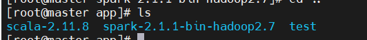
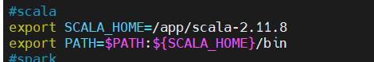

Scala配置

https://github.com/iiizk/download/releases/download/hadoop/scala-2.11.8.tgz

`tar -zxvf scala-2.11.8.tgz -C /ap`



vim /etc/profile
```
#scala
export SCALA_HOME=/app/scala-2.11.8
export PATH=$PATH:${SCALA_HOME}/bin
```




source /etc/profile

`scala -version`

Scala code runner version 2.11.8 -- Copyright 2002-2016, LAMP/EPFL
