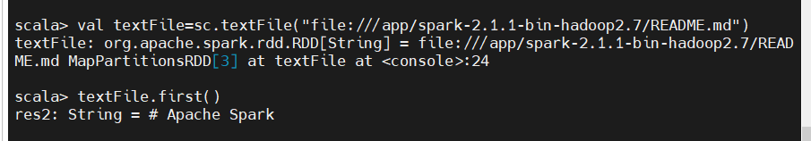

[spark系列2：spark集群的配置与使用_51CTO博客_spark集群](https://blog.51cto.com/u_15346267/3668927)

[spack安装使用_51CTO博客_SPACK](https://blog.51cto.com/u_13323775/2061199)


[TOC]


## Spark配置

###### 名词解释

·    `Driver`
该进程调用 Spark 程序的 main 方法, 并且启动 SparkContext

·    `Cluster Manager`
该进程负责和外部集群工具打交道, 申请或释放集群资源

·    `Worker`
该进程是一个守护进程, 负责启动和管理 Executor

·    `Executor`
该进程是一个JVM虚拟机, 负责运行 Spark Task

###### 总结

- Master 负责总控, 调度, 管理和协调     Worker, 保留资源状况等
- Slave 对应 Worker 节点, 用于启动 Executor 执行 Tasks, 定期向 Master汇报
- Driver 运行在 Client 或者 Slave(Worker) 中, 默认运行在     Slave(Worker) 中

###### 解压：

https://github.com/iiizk/download/releases/download/hadoop/spark-2.1.1-bin-hadoop2.7.tgz

```
cd /app
tar -zxvf spark-2.1.1-bin-hadoop2.7
```

###### 环境变量：
```
#spark
export SPARK_HOME=/app/spark-2.1.1-bin-hadoop2.7
export PATH=$PATH:${SPARK_HOME}/bin
export PATH=$PATH:${SPARK_HOME}/sbin
```


**source /etc/profile**

###### 修改配置文件

**cd /app/spark-2.1.1-bin-hadoop2.7/conf**

**cp spark-env.sh.template spark-env.sh**


###### 1）vim spark-env.sh   指定运行参数

```
#指定 Java Home
export JAVA_HOME=/usr/local/src/jdk1.8.0_221
#指定 Spark Master 地址和端口
export SPARK_MASTER_HOST=master
export SPARK_MASTER_PORT=7077
#指定HDFS配置文件目录，整合Spark和HDFS
export HADOOP_CONF_DIR=/usr/local/src/hadoop-2.7.3/etc/hadoop
```


###### 不用管这个

```
export JAVA_HOME=/usr/local/src/jdk1.8.0_221
export SCALA_HOME=/app/scala-2.11.8
export SPARK_WORKER_MEMORY=1g
export HADOOP_CONF_DIR=/usr/local/src/hadoop-2.7.3/etc/hadoop
```


###### 2）修改配置文件 slaves, 以指定从节点为止, 从在使用 sbin/start-all.sh 启动集群的时候, 可以一键启动整个集群所有的 Worker

- 进入配置目录, 并复制一份新的配置文件, 以供在此基础之上进行修改

```
cp slaves.template slaves
vim slaves
```


###### hadoop1和hadoop2

```
cd /
mkdir app
cd app
```

###### master
`cd /app/spark-2.1.1-bin-hadoop2.7`

###### 把spark分发给hadoop1和hadoop2
```
scp -r /app/spark-2.1.1-bin-hadoop2.7 root@hadoop1:/app
scp -r /app/spark-2.1.1-bin-hadoop2.7 root@hadoop2:/app
```

###### master执行

```
sbin/start-all.sh
```


## 计算
```
bin/spark-submit \
--class org.apache.spark.examples.SparkPi \
--master spark://master:7077 \
--executor-memory 1G \
--total-executor-cores 1 \
examples/jars/spark-examples_2.11-2.1.1.jar \
10
```


###### master启动完全分布式hdfs
```
cd /usr/local/src/hadoop-2.7.3
sbin/start-dfs.sh
cd /app
mkdir test
cd test
vim words.txt
```
hello hadoop
hello spark
hello lisi

###### 吧本地文件上传hdfs
```
hadoop fs -mkdir -p /spark01
hadoop fs -put words.txt /spark01
```


###### shell

cd /app/spark-2.1.1-bin-hadoop2.7/
###### master启动俩个线程
 `bin/spark-shell --master local[2]`


###### 读取本地文件    (第一行)
```
val textFile=sc.textFile("file:///app/spark-2.1.1-bin-hadoop2.7/README.md")

textFile.first()
```



###### 读取HDFS文件  (第一行)
```
val textFile=sc.textFile("hdfs://master:9000/spark01/words.txt")

textFile.first()
```


###### 单词统计
```
val wordCount=textFile.flatMap(line=>line.split(" ")).map(word=>(word,1)).reduceByKey((a,b)=>a+b)

wordCount.collect()
```


###### 测试(单词统计)jar包链接

https://github.com/iiizk/download/releases/download/jar/com.jsck.spark.WordCount.jar

##### IDEA创建maven项目

创建同类型的scala


###### 在scala下创建`包和项目`

```
com.jsck.spark.WordCount
```

###### object WordCount

```
package com.jsck.spark

import org.apache.spark.{SparkConf, SparkContext}

object WordCount {
  def main(args: Array[String]): Unit = {
    //单词记录频次的功能
    //1.创建一个sparkconf对象
    val conf=new SparkConf().setAppName("WordCount")
    //2.创建spark和context对象,它是所有任务计算的源头
    val context =new SparkContext(conf)
    //3.业务逻辑:存放元数据的
    val value =context.textFile(args(0))
    //4.接风每一行获取所有的单词 首先拿到所有的value,然后以空格进行拆分,放的是每一个单词
    val words =value.flatMap(_.split(" "))
    //5.每个单词记为1，把集合中的每个单词转为(单词,1)
    val wordAndOne=words.map(x=>(x,1))
    //6.将相同的单词汇总
    val result =wordAndOne.reduceByKey((x,y)=>x+y)
    //7.在hdfs输出结果数据             //val finalResult=result.collect()    //println(finalResult.toBuffer)

    result.saveAsTextFile(args(1))
    //8.关闭context对象
    context.stop()
  }
}
```

###### pom.xml

```
<?xml version="1.0" encoding="UTF-8"?>
<project xmlns="http://maven.apache.org/POM/4.0.0"
         xmlns:xsi="http://www.w3.org/2001/XMLSchema-instance"
         xsi:schemaLocation="http://maven.apache.org/POM/4.0.0 http://maven.apache.org/xsd/maven-4.0.0.xsd">
    <modelVersion>4.0.0</modelVersion>

    <groupId>org.example</groupId>
    <artifactId>spark</artifactId>
    <version>1.0-SNAPSHOT</version>
    <!--设置依赖版本号-->
    <properties>
        <scala.version>2.11.8</scala.version>
        <hadoop.version>2.7.2</hadoop.version>
        <spark.version>2.1.1</spark.version>
    </properties>

    <dependencies>
        <!--Scala-->
        <dependency>
            <groupId>org.scala-lang</groupId>
            <artifactId>scala-library</artifactId>
            <version>${scala.version}</version>
        </dependency>
        <!--Spark-->
        <dependency>
            <groupId>org.apache.spark</groupId>
            <artifactId>spark-core_2.11</artifactId>
            <version>${spark.version}</version>
        </dependency>
        <!--Hadoop-->
        <dependency>
            <groupId>org.apache.hadoop</groupId>
            <artifactId>hadoop-client</artifactId>
            <version>2.7.2</version>
        </dependency>

    </dependencies>

    <build>
        <sourceDirectory>src/main/scala</sourceDirectory>
        <testSourceDirectory>src/test/scala</testSourceDirectory>

        <plugins>
            <plugin>
                <groupId>net.alchim31.maven</groupId>
                <artifactId>scala-maven-plugin</artifactId>
                <version>3.2.2</version>
                <executions>
                    <execution>
                        <goals>
                            <goal>compile</goal>
                            <goal>testCompile</goal>
                        </goals>
                        <configuration>
                            <args>
                                <arg>-dependencyfile</arg>
                                <arg>${project.build.directory}/.scala_dependencies</arg>
                            </args>
                        </configuration>
                    </execution>
                </executions>
            </plugin>

            <plugin>
                <groupId>org.apache.maven.plugins</groupId>
                <artifactId>maven-shade-plugin</artifactId>
                <version>2.4.3</version>
                <executions>
                    <execution>
                        <phase>package</phase>
                        <goals>
                            <goal>shade</goal>
                        </goals>

                        <configuration>
                            <filters>
                                <filter>
                                    <artifact>:</artifact>
                                    <excludes>
                                        <exclude>META-INF/*.SF</exclude>
                                        <exclude>META-INF/*.DSA</exclude>
                                        <exclude>META-INF/*.RSA</exclude>
                                    </excludes>
                                </filter>
                            </filters>

                            <transformers>
                                <transformer implementation="org.apache.maven.plugins.shade.resource.ManifestResourceTransformer">
                                    <mainClass></mainClass>
                                </transformer>
                            </transformers>
                        </configuration>
                    </execution>
                </executions>
            </plugin>
        </plugins>
    </build>


</project>
```

###### 然后打包


启动hdfs和spark(在主目录下启动)

sbin/start-dfs.sh

sbin/start-all.sh

cd /app/spark-2.1.1-bin-hadoop2.7/
```
bin/spark-submit --master spark://master:7077 \
--class com.jsck.spark.WordCount \
--executor-memory 1g \
--total-executor-cores 1 /app/com.jsck.spark.WordCount.jar /spark01/words.txt /spark01/output 

```


hadoop fs -cat /spark01/output/*


### 启动shell语句（在spark目录下）

` mkdir /test`

`vi /test/word.txt`（随便写一点东西）

```
hellp,zhou
hello,hadoop
hello,saprk
```
```
bin/spark-shell --master local[2]
```
这边我用了`/app/test下的words.txt`
```
val lines=sc.textFile("file:///app/test/words.txt")
```
```
val testRDD =sc.textFile("/spark01/words.txt")
```


```
val array =Array(1,2,3,4,5)

val arrRdd=sc.parallelize(array)
```


######　创建一个RDD(前面已经创建过了)   

###### 这边我用了`spark01下的words.txt`

```
val lines=sc.textFile("file:///spark01/words.txt")
```
```
val linewithspark= lines.filter(line=>line.contains("spark"))
```
###### collect()函数来收集数据
```
lines.collect()
```
```
linewithspark.collect()
```


 ###### 对其进行切分(按行进行切分)

```
val words =lines.map(line=>line.split(" "))
words.collect()
```


###### 对其进行拆分

```
 val words =lines.flatMap(line=>line.split(" "))
 words.collect()
```


###### 分组
```
val words =lines.flatMap(line=>line.split(" ")).map(word=>(word,1))
words.collect()

val groupwords = words.groupByKey()
groupwords.collect()
```


###### 读取这个文件(进行单词统计)

```
val testRDD =sc.textFile("/spark01/words.txt")
```

```
val words =lines.flatMap(line=>line.split(" ")).map(word=>(word,1))

val reducewords = words.reduceByKey((a,b)=>a+b)

reducewords.collect()
```


### **bin/spark-shell --master local[2]**

###### 创建一个Rdd

`val arrRdd=sc.parallelize(Array(1,2,3,4,5))`

`arrRdd.count()`

`arrRdd.first()`

###### 以数组的形式返回前三个数

`arrRdd.take(3)`

###### 换行输出

`arrRdd.foreach(x=>println(x))`