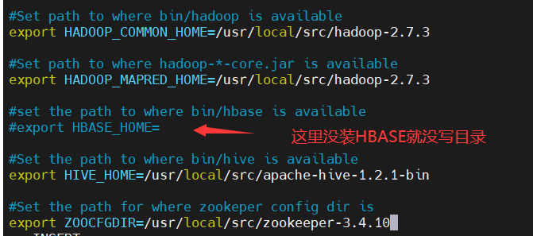
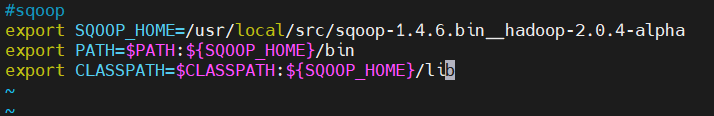
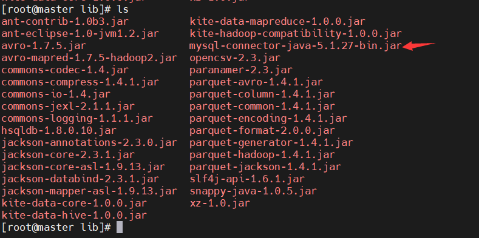
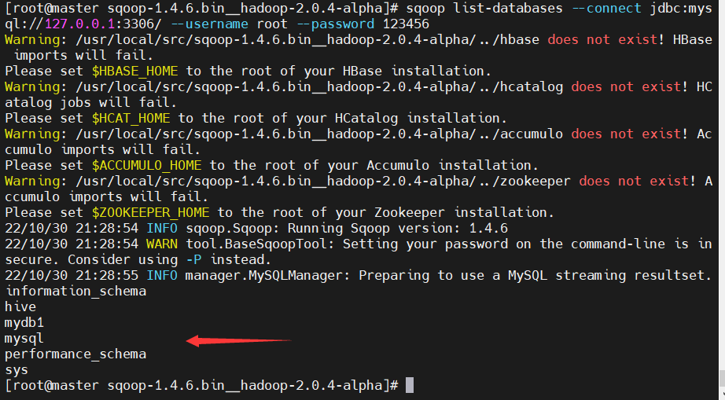

### sqoop安装

###### 1.解压文件
###### 2.进入conf目录
######　3.cp sqoop-env-template.sh sqoop-env.sh

vim sqoop-env.sh



##### 4.配置环境变量(*这个是当前用户的环境变量*)

vim ~/.bashrc
```
#sqoop
export SQOOP_HOME=/usr/local/src/sqoop-1.4.6.bin__hadoop-2.0.4-alpha
export PATH=$PATH:${SQOOP_HOME}/bin
export CLASSPATH=$CLASSPATH:${SQOOP_HOME}/lib
```



###### 生效

source ~/.bashrc

###### 5.在lib路径下添加MySQL驱动程序



######　测试与MySQL连接　　在sqoop根目录输入

```
sqoop list-databases --connect jdbc:mysql://127.0.0.1:3306/ --username root --password 123456
```


